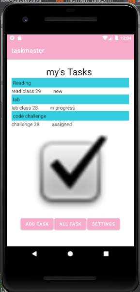

# taskmaster

Task Master is an android application to manage daily tasks built by android studio.

## Home page

* it have a heading at the top of the page, an image to mock the “my tasks” view, and buttons at the bottom of the page to allow going to the “add tasks” and “all tasks” page.

## All Tasks Page

* The all tasks page  just have an image with a back button.

## Add Task page

* On the “Add a Task” page, allow users to type in details about a new task, specifically a title and a body. When users click the “submit” button, show a “submitted!” label on the page.

# lab27:Adding Data to TaskMaster

## Homepage

* The main page contain three different buttons with hardcoded task titles.
* The homepage also contain a button to visit the Settings page, and once the user has entered their username, it should display “{username}’s tasks” above the three task buttons.

## Task Detail Page

* It have a title at the top of the page containe task name , and a Lorem Ipsum description.

## Settings Page

* It allow users to enter their username and hit save.

# lab28:RecyclerViews for Displaying Lists of Data

